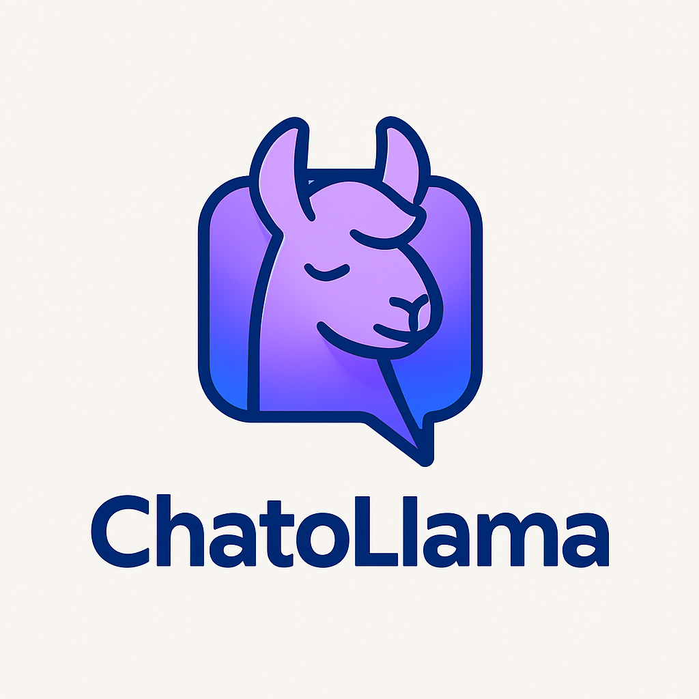
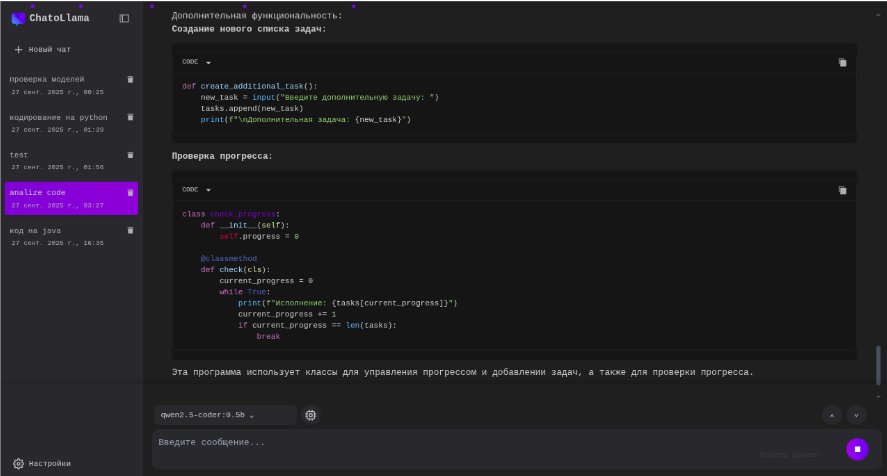
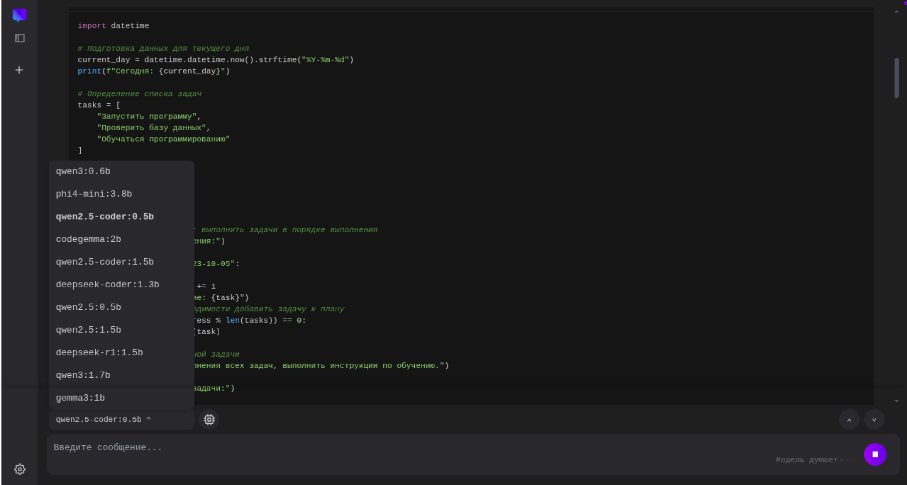
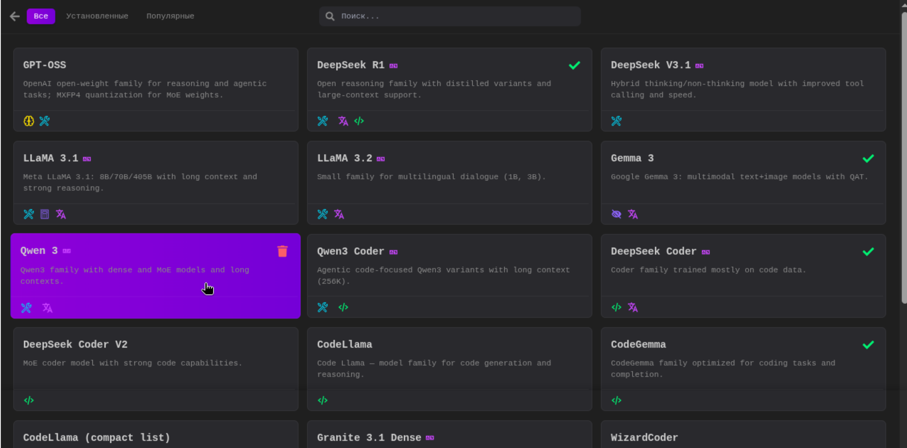

<p align="center">
  
</p>

<h1 align="center">ChatoLlama - Ollama Web Chat Interface</h1>

<p align="center">
  Интерфейс для общения с локальной моделью Ollama через FastAPI и React.
</p>

<p align="center">
  💡 Open Source проект. Поддержите разработку — <br/>
  ⭐ поставьте звезду, 🛠️ внесите вклад или 📣 расскажите другим!
</p>

---

## 🚀 Быстрый старт

### Требования

- Python 3.10+
- Node.js + npm
- Ollama (установите с [официального сайта](https://ollama.com))

### Установка и запуск

```bash
git clone https://github.com/AmidVoshakul/chatollama.git
cd ollama-web-chat/
chmod +x startvenv.sh
./startvenv.sh
```








## 📌 Лицензия

Этот проект распространяется под лицензией MIT.